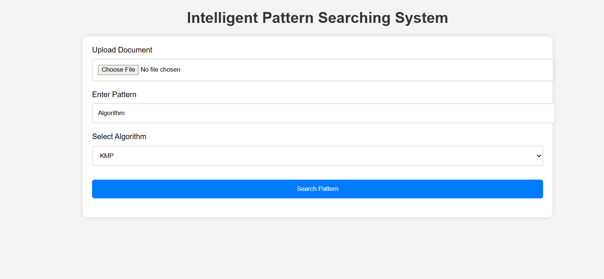
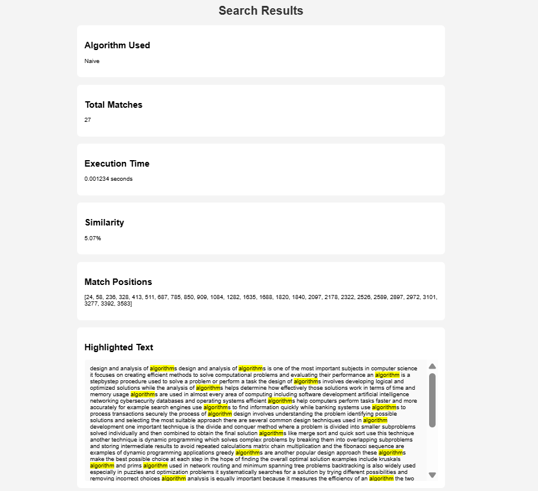

# Intelligent Pattern Searching System for Plagiarism Detection

## Live Demo

🔗 https://plagiarism-detection-system-b2y8f17mn.vercel.app

---

An advanced plagiarism detection and pattern searching web application developed using **Python Flask**, implementing classical **String Matching Algorithms** for academic document analysis.

The system efficiently detects:

- Exact keyword matches
- Duplicate sentence patterns
- Repeated phrases
- Pattern occurrence frequency
- Match positions in documents

It also compares algorithm performance based on:

- Execution Time
- Search Accuracy
- Match Count
- Scalability

---

# Project Preview

## Home Page



---

## Search Result Page



---

# Features

- Responsive modern UI
- Upload TXT/PDF/DOCX files
- Multiple pattern searching algorithms
- Highlight matched patterns
- Display:
  - Total matches
  - Match positions
  - Similarity percentage
  - Execution time
- Graph visualization using Chart.js
- Case-insensitive searching
- Real-time result generation

---

# Algorithms Implemented

| Algorithm | Technique | Best Case | Worst Case |
|---|---|---|---|
| Naïve Search | Sequential Comparison | O(n) | O(nm) |
| KMP | Prefix Table (LPS) | O(n) | O(n+m) |
| Rabin-Karp | Hashing | O(n+m) | O(nm) |
| Boyer-Moore | Bad Character Heuristic | O(n/m) | O(nm) |

---

# Technologies Used

| Component | Technology |
|---|---|
| Backend | Python Flask |
| Frontend | HTML, CSS, JavaScript |
| Visualization | Chart.js |
| File Handling | PyPDF2, python-docx |
| IDE | VS Code |

---

# Project Structure

```text
plagiarism_detection_system/
│
├── app.py
├── requirements.txt
├── README.md
│
├── algorithms/
│   ├── naive.py
│   ├── kmp.py
│   ├── rabin_karp.py
│   └── boyer_moore.py
│
├── utils/
│   ├── preprocess.py
│   ├── file_reader.py
│   └── similarity.py
│
├── static/
│   ├── css/
│   │   └── style.css
│   │
│   ├── js/
│   │   └── app.js
│   │
│   └── uploads/
│
├── templates/
│   ├── index.html
│   └── result.html
│
└── results/
